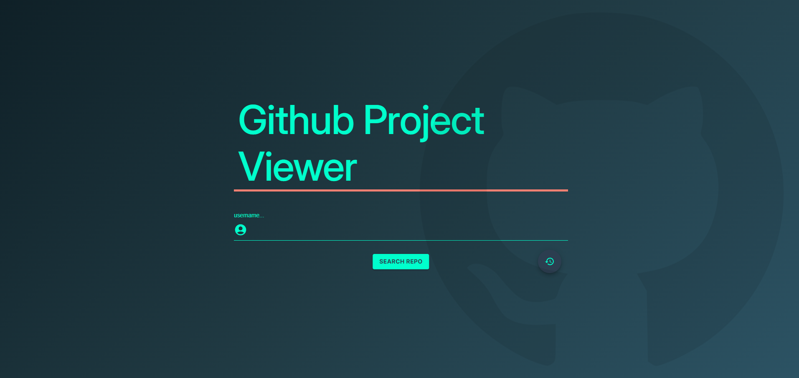
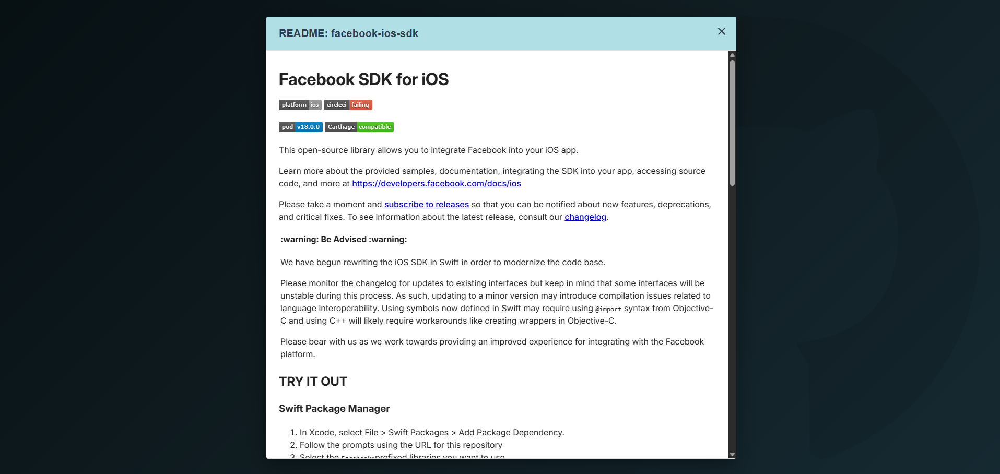
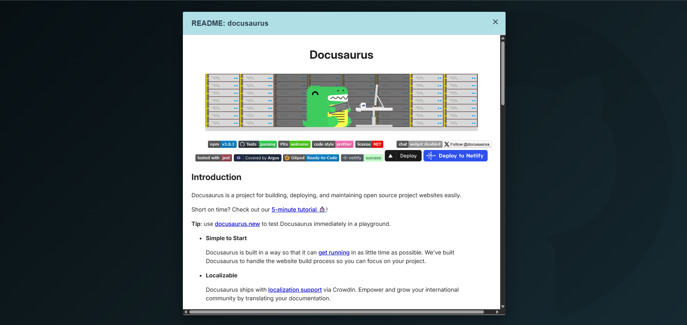
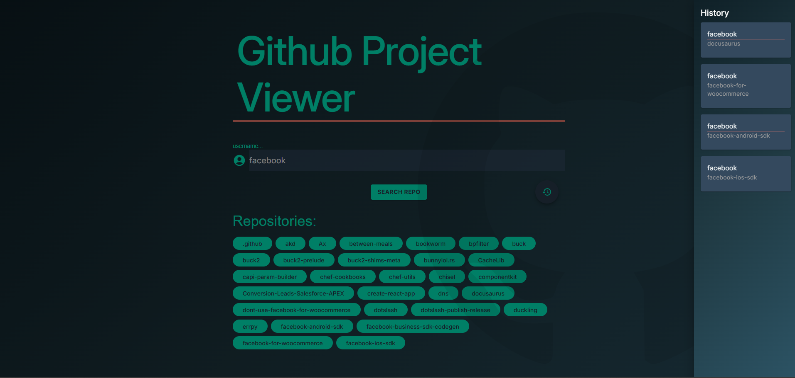

# GitHub Project Viewer 🔍

A simple React + TypeScript application that allows you to search for a GitHub username, display their public repositories, and view the content of each repository’s README file in a clean Markdown preview.

🚀 **Live Demo:** [funny-halva-89f9d2.netlify.app](https://funny-halva-89f9d2.netlify.app)

---

## ✨ Features

- 🔎 Search GitHub users by username
- 📦 Display list of public repositories
- 📄 View `README.md` files with rendered Markdown
- ⚡ Fast and responsive UI
- 🧼 No CSS framework – fully custom styled
- ✅ Lighthouse Score > 90 (performance, accessibility, SEO)

---

## 🧰 Tech Stack

- ⚛️ React + TypeScript
- 🔗 GitHub REST API v3
- 🧪 Custom Markdown Renderer
- 🚀 Hosted on Netlify
- 🔧 No CSS libraries (pure responsive CSS)

---

## 📸 Preview

| Home Page                    | Repository List               | Markdown View                 | Responsive                    |
| ---------------------------- | ----------------------------- | ----------------------------- | ----------------------------- | ----------------------------- |
|  |  |  |  |  |

---

## 🛠️ Installation & Development

```bash
# Clone the repo
git clone https://github.com/your-username/github-project-viewer.git
cd github-project-viewer

# Install dependencies
npm install

# Run locally
npm run dev
```
